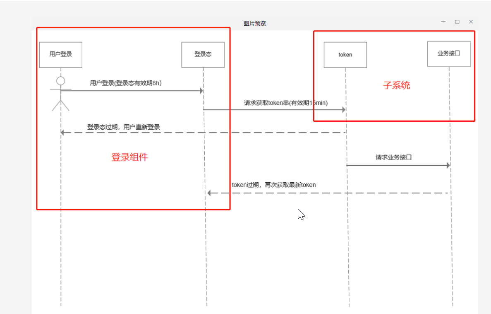

单点登录实现方式 

逻辑：

1.用户统一在认证中心进行登录，登录成功之后，认证中心负责登录和分发token

​		通过iframe.contentWindow.postMessage分发token

2.子系统使用localStorage存储token，请求接口时带上token。检查当前请求有没有token,如果没有，说明用户在当前系统中尚未登录，那么就将页面跳转至认证中心。由于这个操作会将认证中心的localStorage自动带过去，因此，认证中心能够根据LocalStorage知道用户是否已经登录过了。如果认证中心发现用户尚未登录，则返回登录页面，等待用户登录，如果发现用户已经登录过了，就不会让用户再次登录了，而是会跳转回子系统的 URL ，并在跳转前生成一个 Token，拼接在子系统 URL 的后面，回传给子系统。

3.接口内部添加token统一验证逻辑，子系统获得token之后，还需要向认证中心确认下token的合法性，防止用户伪造。确认无误后，子系统记录用户的登录状态，并将token写入localStorage，然后给本次访问放行。当用户再次访问子系统时，就会自动带上这个 Token，应用系统验证 Token 发现用户已登录，于是就不会有认证中心什么事了。

4.token过期，给前端返回错误码；前端根据错误码，再次请求认证中心登录+获取token

实现单点登录，跨域可以使用localStorage postMessage和iframe解决。         

 sessionStorage是会话级别的，标签关闭就没有了， 而且只能在当前标签内使用。

localStorage是持久化数据        

对loginInfo做的处理,将loginInfo并存入到sessionStorage中,每次读取登录信息用getItem从loginInfo获取

loginSuccessHandler= ( ) =>{

​	sessionStorage.setItem('login','true');

​	let loginInfo = sessionStorage.getItem('loginInfo');

​	GlobalInfo.initLoginInfo(JSON.parse(loginInfo));

​	this.props.history.push('/main');

}                                   

 如果登录成功并且设置为记住密码，则把登录信息存入到localStorage中，以后从localStorage中获取数据即可，如果不设记住密码，localStorage里的密码字段为空，则每次进入时都要输入密码。

1.获取一个不可见的iframe（项目中是frame）

var frame = document.getElementById('iframe-' + CurrentModule.moduleId)

2.使用postMessage()方法将parame传递给iframe传送跨域数据
frame.contentWindow.postMessage(param,data.origin)
postMessage可以通过绑定window的message把登录态传递给子系统页面，实现跨文档消息传输，用于解决以下问题：
　a.） 页面和其打开的新窗口的数据传递
　b.） 多窗口之间消息传递
　c.） 页面与嵌套的iframe消息传递
　d.） 上面三个场景的跨域数据传递
用法：
postMessage(data,origin)方法接受两个参数：
	data：任意基本类型或可复制的对象，但部分浏览器只支持字符串，所以传参时最好用JSON.stringify()序列化。
	origin： 协议+主机+端口号，也可以设置为"*"，表示可以传递给任意窗口，如果要指定和当前窗口同源的话设置为"/"。

前端通过iframe+postMessage()方式，将同一份Token写入到了多个域下的LocalStorage中，前端每次在向后端发送请求之前，都会主动从LocalStorage中读取Token并在请求中携带，这样就实现了同一份Token被多个域所共享。

认证中心+localStorage存储登录信息，生成token，postMessage和iframe分发token。

通过this.setstate()函数里设定时间通过触发一次组件的更新来引发重绘进行同步更新组件。
....
this.setState({errorMsg:err.message});
},3000);

3.子系统添加事件监听器监听发送的数据

window.addEventListener('message',function(e){

})

4.token过期，给前端返回错误码；前端根据错误码，再次请求认证中心登录+获取token

 sessionStorage是会话级别的，标签关闭就没有了， 而且只能在当前标签内使用。

localStorage是持久化数据        

对loginInfo做的处理,将loginInfo并存入到sessionStorage中,每次读取登录信息用getItem从loginInfo获取

